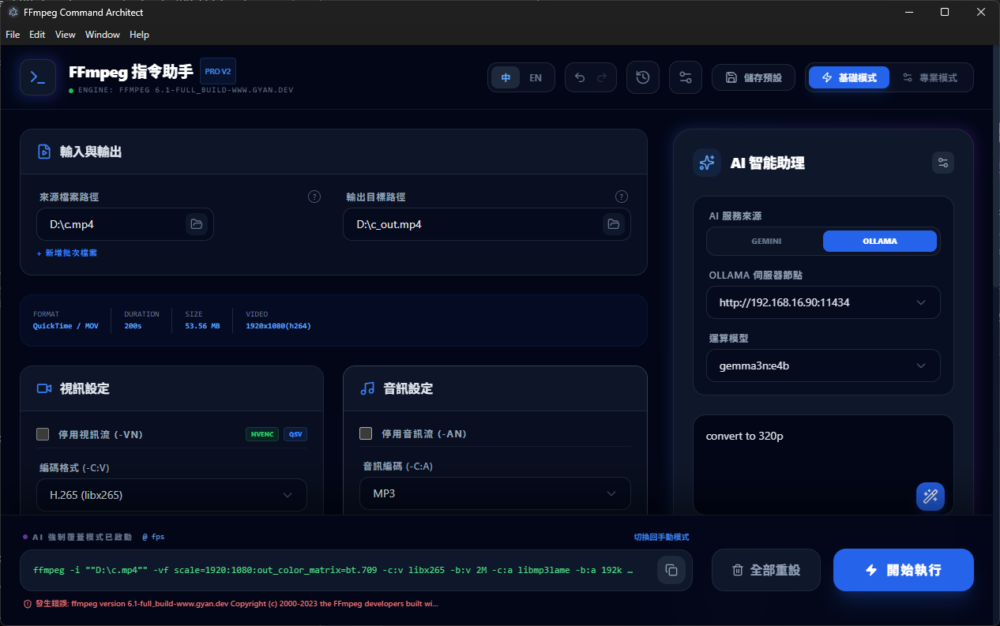

# FFmpeg 指令助手 (FFmpeg Command Master)


FFmpeg 指令助手是一個專業的桌面應用程式，旨在將複雜的 FFmpeg 命令行操作轉化為直觀、高效且具備 AI 輔助的圖形化介面。本專案特別針對台灣使用者進行了專業術語的在地化優化。

## 📸 介面預覽



## ✨ 核心特色

- **AI 智能助理:** 整合 Gemini (雲端) 與 Ollama (本地)，支援自然語言輸入。系統會自動解析 AI 建議並套用到 UI 配置中。
- **動態環境偵測:** 自動執行 `ffmpeg -version` 獲取版本，並掃描系統顯卡支援的硬體加速 (NVENC, QSV, AMF, VAAPI)。
- **原生檔案瀏覽:** 整合 Windows 原生檔案選擇與儲存對話框，支援多選批次輸入與自動路徑建議。
- **批次處理引擎:** 支援多個檔案同時加入隊列，可選擇依序處理或平行處理。
- **視訊技術面板:** 透過 `ffprobe` 即時解析媒體檔案，顯示解析度、碼率、編碼格式與持續時間。
- **復原/重做系統:** 全面的 Undo/Redo 支援，輕鬆嘗試各種參數組合而不用擔心丟失配置。
- **預設集庫:** 將常用的配置儲存為預設集，並持久化儲存於 SQLite 資料庫中。
- **執行紀錄與進度:** 即時解析 FFmpeg `stderr` 串流，顯示 FPS、剩餘時間與視覺化進度條。

## 🚀 快速開始

### 開發環境需求
- Node.js (v18+)
- FFmpeg & FFprobe (可在 App 設定中自定義路徑)
- Ollama (選配，用於本地 AI 功能)

### 安裝步驟
1. 複製儲存庫：
   ```bash
   git clone https://github.com/your-repo/ffmpeg-command-master.git
   cd ffmpeg-command-master/ffmpeg-command-architect
   ```
2. 安裝依賴：
   ```bash
   npm install
   ```
3. 若遇到原生模組錯誤，執行重建：
   ```bash
   npm run rebuild
   ```
4. 啟動開發伺服器 (包含 Electron)：
   ```bash
   npm run electron:dev
   ```

## 🛠 技術棧
- **核心:** React 19 + TypeScript + Vite
- **外殼:** Electron (整合 IPC 通訊與原生 API)
- **資料庫:** SQLite (Better-SQLite3)
- **樣式:** Tailwind CSS (專業級 Night Owl 深色主題)
- **圖示:** Lucide React

## 📅 開發進度
- [x] **第一階段:** 核心指令構建引擎與 UI 骨架。
- [x] **第二階段:** SQLite 持久化（預設集、歷史紀錄、系統設定）。
- [x] **第三階段:** AI 整合（Gemini 雲端 + Ollama 本地多伺服器支援）。
- [x] **第四階段:** 檔案瀏覽、自動路徑、動態環境偵測。
- [x] **第五階段:** 批次處理、Undo/Redo、錯誤邊界 (Fail-safe) 機制。

## 📄 授權
本專案採用 MIT 授權條款。
