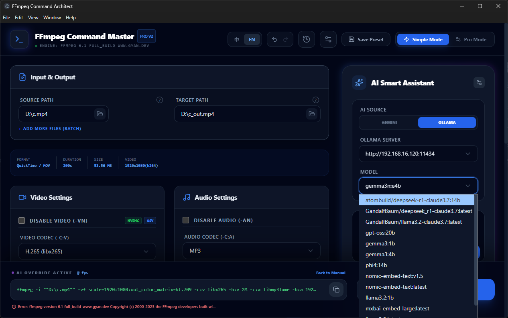

# FFmpeg Command Master


FFmpeg Command Master is a sophisticated desktop application designed to transform complex FFmpeg CLI operations into an intuitive, efficient, and AI-powered graphical interface. It bridges the gap between powerful CLI capabilities and user-friendly GUI experiences.

## 📸 Screenshots



## ✨ Core Features

- **AI Smart Assistant:** Seamlessly integrated with Gemini (Cloud) and Ollama (Local). Supports natural language prompts to generate and auto-apply complex FFmpeg configurations.
- **Dynamic Environment Detection:** Automatically fetches FFmpeg version and scans for hardware-accelerated encoders (NVENC, QSV, AMF, VAAPI).
- **Native File Browsing:** Integrated Windows native open/save dialogs with support for multi-file batch selection and smart output path suggestion.
- **Batch Processing Engine:** Queue multiple files for sequential or parallel execution with real-time status updates.
- **Technical Metadata Panel:** Deep analysis of media files via `ffprobe`, displaying resolution, bitrate, codecs, and duration.
- **Undo/Redo System:** Comprehensive state management allowing users to experiment with parameters safely.
- **Presets Library:** Save and reload favorite configurations, persisted via local SQLite database.
- **Execution Progress:** Real-time parsing of FFmpeg `stderr`, providing visual progress bars, FPS, and speed tracking.

## 🚀 Getting Started

### Prerequisites
- Node.js (v18+)
- FFmpeg & FFprobe (Path can be customized within the app)
- Ollama (Optional, for local AI functionality)

### Installation
1. Clone the repository:
   ```bash
   git clone https://github.com/your-repo/ffmpeg-command-master.git
   cd ffmpeg-command-master/ffmpeg-command-architect
   ```
2. Install dependencies:
   ```bash
   npm install
   ```
3. Rebuild native modules (if necessary):
   ```bash
   npm run rebuild
   ```
4. Launch development server (with Electron):
   ```bash
   npm run electron:dev
   ```

## 🛠 Tech Stack
- **Frontend:** React 19 + TypeScript + Vite
- **Shell:** Electron (IPC Bridge & Native API Integration)
- **Database:** SQLite (Better-SQLite3)
- **Styling:** Tailwind CSS (Night Owl Theme)
- **Icons:** Lucide React

## 📅 Development Progress
- [x] **Phase 1:** Core engine and UI scaffolding.
- [x] **Phase 2:** SQLite persistence (Presets, History, Settings).
- [x] **Phase 3:** AI Integration (Gemini + Ollama dynamic servers).
- [x] **Phase 4:** Native browsing, Smart paths, Dynamic environment detection.
- [x] **Phase 5:** Batch processing, Undo/Redo, and Error Boundary (Fail-safe).

## 📄 License
This project is licensed under the MIT License.